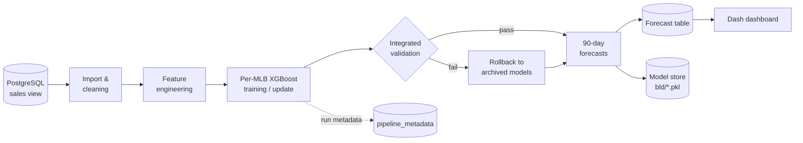

<div align="center">

# 📈 Project Sales Prediction

**Per-listing sales forecasting for Mercado Livre, with continuous learning, automated
validation, and a live dashboard.**


[Overview](#-overview) • [Features](#-features) • [Architecture](#-architecture) •
[Getting started](#-getting-started) • [Usage](#-usage) •
[Configuration](#%EF%B8%8F-configuration) • [License](#-license)

</div>

______________________________________________________________________

## 🔎 Overview

Project Sales Prediction trains an individual **XGBoost regressor for every active
Mercado Livre listing (MLB)** and produces a **90-day daily sales forecast** for each
one.

Sales history is read from PostgreSQL, cleaned, and turned into time-series features
(calendar effects, lags, rolling means, price). Forecasts are written back to the
database, where they feed downstream planning and an interactive Dash dashboard.

The system is built to run unattended. It updates models incrementally as new data
arrives, validates every model and forecast before publishing, rolls back automatically
when quality degrades, and keeps a full audit trail of every run.

## ✨ Features

|                              |                                                                                                                       |
| ---------------------------- | --------------------------------------------------------------------------------------------------------------------- |
| 🎯 **Per-listing models**    | One XGBoost model per MLB, capturing listing-specific demand patterns                                                 |
| 🔭 **90-day horizon**        | Direct multi-step forecasting; horizon configurable via environment variable                                          |
| 🔁 **Continuous learning**   | Daily incremental updates, full retrains, date-bounded backfills, and monthly sliding-window refreshes                |
| 🛡️ **Validation & rollback** | Integrated model and forecast checks; models are archived and restored automatically if performance drops             |
| 🧾 **Run metadata**          | Every run and rollback decision is logged to `public.pipeline_metadata`                                               |
| 🚀 **Deployment-ready**      | Environment validation, rotating logs, cleanup handling, and cron launchers with meaningful exit codes                |
| 📊 **Dashboard**             | Dash + Plotly UI with MLB/SKU/date filters, 15-minute caching, and graceful fallback when the database is unavailable |
| 🧪 **Dry-run mirrors**       | Every entry point has a `test_*` twin limited to a handful of MLBs for fast, safe checks                              |

## 🏗 Architecture



### Pipeline modes

| Mode                | What it does                                                                      | Typical schedule |
| ------------------- | --------------------------------------------------------------------------------- | ---------------- |
| `daily` *(default)* | Continues training existing models on data since the last successful run          | Every day        |
| `monthly`           | Retrains on a six-month sliding window and keeps the better of old vs. new models | Monthly          |
| `full`              | Clean retrain on all history, with automatic fallback to archived models          | On demand        |
| `--since-date`      | Rebuilds models using data from a given date onward                               | Backfills        |

### Project structure

```text
Project-Sales-Prediction/
├── environment.yml                 # Conda environment (fcast_project)
├── LICENSE
└── src/
    ├── machine_learning/
    │   ├── config.py               # Central configuration (env-driven)
    │   ├── script_final.py         # Full production refresh
    │   ├── deploy_pipeline.py      # Hardened deployment entry point
    │   ├── pipeline/               # Unified runner + integrated validator
    │   ├── data_management/        # SQL import, cleaning, features, metadata
    │   ├── estimation/             # Training, forecasting, model storage
    │   ├── validation/             # Model/forecast validators, model comparison
    │   ├── deployment/             # Env checks, logging, paths, cleanup
    │   ├── cron_scripts/           # Cron launchers (prod + test)
    │   ├── backtesting/            # Synthetic data generator + rolling-origin backtest
    │   └── notebooks/              # Exploratory analysis
    └── web_app/
        └── script_webapp.py        # Dash dashboard
```

## 🚀 Getting started

### Prerequisites

- [Mamba](https://mamba.readthedocs.io/) or Conda
- Network access to the PostgreSQL instance holding the sales data

### Installation

```bash
git clone https://github.com/Okim343/Project-Sales-Prediction.git
cd Project-Sales-Prediction
mamba env create -f environment.yml
conda activate fcast_project
pre-commit install
```

Set your database credentials (or put them in a `.env` file at the project root):

```bash
export DB_HOST=your_host
export DB_USER=your_user
export DB_PASSWORD=your_password
export DB_NAME=your_database
```

## 🧭 Usage

**Continuous learning pipeline**

```bash
python src/machine_learning/pipeline/pipeline_runner.py                       # daily
python src/machine_learning/pipeline/pipeline_runner.py --mode=monthly
python src/machine_learning/pipeline/pipeline_runner.py --mode=full
python src/machine_learning/pipeline/pipeline_runner.py --since-date=2025-01-15
```

**Production deployment** (environment checks, rotating logs, safe cleanup)

```bash
python src/machine_learning/deploy_pipeline.py --mode=daily
```

**Scheduling with cron**

```cron
0 3 * * *  bash /path/to/Project-Sales-Prediction/src/machine_learning/cron_scripts/daily_cron.sh
0 4 1 * *  bash /path/to/Project-Sales-Prediction/src/machine_learning/cron_scripts/monthly_cron.sh
```

**Full production refresh**

```bash
python src/machine_learning/script_final.py
```

**Dashboard** at <http://127.0.0.1:8050>

```bash
python src/web_app/script_webapp.py
```

> [!TIP]
> Each entry point has a `test_*` counterpart (for example
> `pipeline/test_pipeline_runner.py` or `cron_scripts/test_daily_cron.sh`) that runs the
> same logic on a small subset of MLBs and writes to a separate test table.

## 📏 Backtesting

`src/machine_learning/backtesting/` scores the production model against simple baselines
with a rolling-origin backtest. For each cutoff, every model sees only data up to that
date and is scored on the next 90 days. Results are averaged over 4 cutoffs, 30 days
apart.

It runs on two sources:

- **Historical export**: `data/raw_sql.csv` (git-ignored; SKU-level, Dec 2023 – Mar
  2025).
- **Synthetic data**: generated to match the production view's columns and calibrated to
  the historical export. It has weekday pattern, growth, yearly seasonality, Black
  Friday and Christmas, price discounts, stockouts, and staggered launches. The planted
  parameters and true pre-stockout demand are saved as ground truth.

```bash
cd src/machine_learning
python backtesting/synthetic_data.py                        # (re)generate data/synthetic_orders.csv
python backtesting/run_backtest.py --source both            # full run incl. LightGBM, about 10 minutes
python backtesting/run_backtest.py --source real --skip-current   # baselines only, seconds
python -m pytest backtesting -q
```

Results land in `bld/backtest/<source>_<timestamp>/` (`summary.md`, `scores.csv`,
`forecasts.parquet`).

| Metric | Meaning                                                                                             |
| ------ | --------------------------------------------------------------------------------------------------- |
| WAPE   | Total absolute error / total units sold. The headline number; lower is better.                      |
| MASE   | Error relative to a 7-day seasonal naive forecast on the training data; below 1 beats it in-sample. |
| Bias   | Total error / total units sold. Positive means over-forecasting.                                    |

Baselines: `seasonal_naive_7` (repeat last week), `weekday_mean_4w` (mean of the same
weekday over the last 4 weeks), `moving_average_28` (flat 28-day mean). A new model
should beat all three before it replaces the production one.

### LightGBM challenger

`backtesting/lightgbm_model.py` trains **global LightGBM regressors** (Tweedie
objective) across series up to the cutoff, instead of one XGBoost per listing. Features
describe the target date (weekday, day of month, Black Friday, Christmas, Brazilian
holidays) and each series' recent sales (lags, rolling means, same-weekday mean), last
known unit price, volume level and identity. Two strategies are available: `direct` (one
model per horizon block, days 1–7 / 8–30 / 31–90, using only values known at the origin)
and `recursive` (one-step model fed its own predictions). A stockout proxy drops
implausible zero-sales runs from the training targets.

```bash
python backtesting/run_backtest.py --models "baselines,lgbm_direct"               # challenger only
python backtesting/run_backtest.py --models "baselines,lgbm_direct*" --skip-current  # ablations
python backtesting/run_backtest.py --source synthetic --true-demand                # also score vs true demand
```

`--models` takes names or glob patterns; the variants are listed in `LGBM_VARIANTS`.
`lgbm_direct` remains uncalibrated. The diagnostic `lgbm_direct_cal_block_tier` trains
an inner model at cutoff −90 days and selects validation series by the production
eligibility rule **at that inner origin**. Its raw observed-sales actual/forecast ratio
is clipped to \[0.8, 1.5\]. The harness writes each cutoff's raw and applied factors to
`calibration_factors.csv`. The previously promoted shrunk, floored calibration is
retained as `lgbm_direct_cal_shrunk` for comparison.

Common-set **WAPE / MASE / bias** on observed sales, 4 cutoffs:

| Model                        | Real                       | Synthetic                  |
| ---------------------------- | -------------------------- | -------------------------- |
| `lgbm_direct`                | **0.748 / 1.090 / −0.108** | **0.773 / 1.289 / −0.101** |
| `lgbm_direct_cal_block_tier` | 0.803 / 1.179 / +0.099     | 0.774 / 1.302 / −0.092     |
| `lgbm_direct_cal_shrunk`     | 0.765 / 1.119 / −0.010     | 0.787 / 1.314 / −0.046     |
| `lgbm_direct_constant_1p10`  | 0.765 / 1.117 / −0.019     | 0.797 / 1.332 / −0.011     |
| `lgbm_blend_50_50`           | 0.759 / 1.130 / −0.059     | 0.773 / 1.289 / −0.079     |
| `lgbm_recursive`             | 0.789 / 1.196 / −0.009     | 0.787 / 1.310 / −0.058     |
| `weekday_mean_4w`            | 0.851 / 1.254 / +0.121     | 0.838 / 1.377 / −0.092     |
| `current_xgboost`            | 0.908 / 1.435 / +0.081     | 0.814 / 1.353 / −0.153     |

Correcting validation eligibility reduced the raw calibration's real overprediction, but
it still misses the ±5% bias target on both sources. The shrunk rule reaches that target
in aggregate, yet its 1.06 floor binds in 22 of 24 synthetic block/tier cells; its
settings were selected on these same backtest folds. Bias also shifts sharply between
cutoffs, and calibration raises MASE. Keep the uncalibrated model as the backtesting
default while evaluating predeclared challengers on new dates. See
[`BIAS_CORRECTION_RESULTS.md`](src/machine_learning/backtesting/BIAS_CORRECTION_RESULTS.md)
for cutoff, horizon, volume-tier, factor and true-demand results.

### Replenishment backtest

Add `--replenishment` to score total demand over configurable protection windows
(`--windows 7,14,28`) at configurable service levels
(`--service-levels 0.5,0.8,0.9,0.95`). It fits leakage-free inner-fold window
distributions for every selected mean forecast, tests a direct LightGBM window quantile
model, and writes window forecasts, dispersion estimates, and ordering trade-offs. Use
`--true-demand` to also evaluate synthetic demand before stockout censoring. The windows
and levels are placeholders pending business inputs.

On the four-cutoff comparison, **none** of the direct, 50/50 blend, or recursive
LightGBM means met the required 90% coverage band in both real-data volume tiers at any
window. The closest were recursive at 7 days, blend at 14 days, and direct at 28 days.
The direct window-quantile challenger lowered average scaled pinball but also missed
coverage, so no LightGBM replenishment forecast is ready for deployment. See
[`REPLENISHMENT_RESULTS.md`](src/machine_learning/backtesting/REPLENISHMENT_RESULTS.md)
for the full observed-sales and true-demand results.

## ⚙️ Configuration

All settings live in [`src/machine_learning/config.py`](src/machine_learning/config.py)
and can be overridden through environment variables.

| Variable                    | Default                        | Description                                           |
| --------------------------- | ------------------------------ | ----------------------------------------------------- |
| `DB_HOST` / `DB_PORT`       | — / `5432`                     | PostgreSQL host and port                              |
| `DB_USER` / `DB_PASSWORD`   | —                              | Database credentials                                  |
| `DB_NAME`                   | `Mercado Livre`                | Database name                                         |
| `DB_VIEW`                   | `public.view_enrico`           | Input sales view                                      |
| `DB_FORECAST_TABLE`         | `public.mlb_forecasts_90_days` | Forecast output table                                 |
| `FORECAST_DAYS_LONG`        | `90`                           | Production forecast horizon (days)                    |
| `FORECAST_DAYS`             | `30`                           | Short horizon used by legacy/test helpers             |
| `ACTIVE_MLB_DAYS_THRESHOLD` | `30`                           | Days of recent activity for an MLB to count as active |
| `TEST_MLB_COUNT`            | `5`                            | Number of MLBs used by `test_*` scripts               |

XGBoost hyperparameters are defined in
[`src/machine_learning/estimation/model.py`](src/machine_learning/estimation/model.py).

## 🗺 Roadmap

- [ ] Alerting for data freshness, pipeline failures, and forecast anomalies
- [ ] Automated feature-drift tracking for incremental runs
- [ ] Faster, leaner incremental training for large MLB sets

## 📄 License

**Proprietary — all rights reserved.** © 2025–2026 Enrico Truzzi.

This repository is not open source. Viewing the code does not grant permission to run,
copy, modify, or distribute it. Any use requires prior written permission from the
author. See [`LICENSE`](LICENSE) for the full terms.
