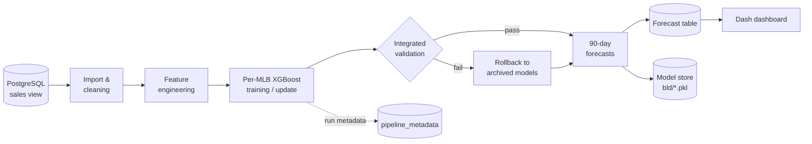

<div align="center">

# 📈 Project Sales Prediction

**Per-listing sales forecasting for Mercado Livre, with continuous learning, automated
validation, and a live dashboard.**


[Overview](#-overview) • [Features](#-features) • [Architecture](#-architecture) •
[Getting started](#-getting-started) • [Usage](#-usage) •
[Configuration](#%EF%B8%8F-configuration) • [License](#-license)

</div>

______________________________________________________________________

## 🔎 Overview

Project Sales Prediction trains an individual **XGBoost regressor for every active
Mercado Livre listing (MLB)** and produces a **90-day daily sales forecast** for each
one.

Sales history is read from PostgreSQL, cleaned, and turned into time-series features
(calendar effects, lags, rolling means, price). Forecasts are written back to the
database, where they feed downstream planning and an interactive Dash dashboard.

The system is built to run unattended. It updates models incrementally as new data
arrives, validates every model and forecast before publishing, rolls back automatically
when quality degrades, and keeps a full audit trail of every run.

## ✨ Features

|                              |                                                                                                                       |
| ---------------------------- | --------------------------------------------------------------------------------------------------------------------- |
| 🎯 **Per-listing models**    | One XGBoost model per MLB, capturing listing-specific demand patterns                                                 |
| 🔭 **90-day horizon**        | Direct multi-step forecasting; horizon configurable via environment variable                                          |
| 🔁 **Continuous learning**   | Daily incremental updates, full retrains, date-bounded backfills, and monthly sliding-window refreshes                |
| 🛡️ **Validation & rollback** | Integrated model and forecast checks; models are archived and restored automatically if performance drops             |
| 🧾 **Run metadata**          | Every run and rollback decision is logged to `public.pipeline_metadata`                                               |
| 🚀 **Deployment-ready**      | Environment validation, rotating logs, cleanup handling, and cron launchers with meaningful exit codes                |
| 📊 **Dashboard**             | Dash + Plotly UI with MLB/SKU/date filters, 15-minute caching, and graceful fallback when the database is unavailable |
| 🧪 **Dry-run mirrors**       | Every entry point has a `test_*` twin limited to a handful of MLBs for fast, safe checks                              |

## 🏗 Architecture



### Pipeline modes

| Mode                | What it does                                                                      | Typical schedule |
| ------------------- | --------------------------------------------------------------------------------- | ---------------- |
| `daily` *(default)* | Continues training existing models on data since the last successful run          | Every day        |
| `monthly`           | Retrains on a six-month sliding window and keeps the better of old vs. new models | Monthly          |
| `full`              | Clean retrain on all history, with automatic fallback to archived models          | On demand        |
| `--since-date`      | Rebuilds models using data from a given date onward                               | Backfills        |

### Project structure

```text
Project-Sales-Prediction/
├── environment.yml                 # Conda environment (fcast_project)
├── LICENSE
└── src/
    ├── machine_learning/
    │   ├── config.py               # Central configuration (env-driven)
    │   ├── script_final.py         # Full production refresh
    │   ├── deploy_pipeline.py      # Hardened deployment entry point
    │   ├── pipeline/               # Unified runner + integrated validator
    │   ├── data_management/        # SQL import, cleaning, features, metadata
    │   ├── estimation/             # Training, forecasting, model storage
    │   ├── validation/             # Model/forecast validators, model comparison
    │   ├── deployment/             # Env checks, logging, paths, cleanup
    │   ├── cron_scripts/           # Cron launchers (prod + test)
    │   └── notebooks/              # Exploratory analysis
    └── web_app/
        └── script_webapp.py        # Dash dashboard
```

## 🚀 Getting started

### Prerequisites

- [Mamba](https://mamba.readthedocs.io/) or Conda
- Network access to the PostgreSQL instance holding the sales data

### Installation

```bash
git clone https://github.com/Okim343/Project-Sales-Prediction.git
cd Project-Sales-Prediction
mamba env create -f environment.yml
conda activate fcast_project
pre-commit install
```

Set your database credentials (or put them in a `.env` file at the project root):

```bash
export DB_HOST=your_host
export DB_USER=your_user
export DB_PASSWORD=your_password
export DB_NAME=your_database
```

## 🧭 Usage

**Continuous learning pipeline**

```bash
python src/machine_learning/pipeline/pipeline_runner.py                       # daily
python src/machine_learning/pipeline/pipeline_runner.py --mode=monthly
python src/machine_learning/pipeline/pipeline_runner.py --mode=full
python src/machine_learning/pipeline/pipeline_runner.py --since-date=2025-01-15
```

**Production deployment** (environment checks, rotating logs, safe cleanup)

```bash
python src/machine_learning/deploy_pipeline.py --mode=daily
```

**Scheduling with cron**

```cron
0 3 * * *  bash /path/to/Project-Sales-Prediction/src/machine_learning/cron_scripts/daily_cron.sh
0 4 1 * *  bash /path/to/Project-Sales-Prediction/src/machine_learning/cron_scripts/monthly_cron.sh
```

**Full production refresh**

```bash
python src/machine_learning/script_final.py
```

**Dashboard** at <http://127.0.0.1:8050>

```bash
python src/web_app/script_webapp.py
```

> [!TIP]
> Each entry point has a `test_*` counterpart (for example
> `pipeline/test_pipeline_runner.py` or `cron_scripts/test_daily_cron.sh`) that runs the
> same logic on a small subset of MLBs and writes to a separate test table.

## ⚙️ Configuration

All settings live in [`src/machine_learning/config.py`](src/machine_learning/config.py)
and can be overridden through environment variables.

| Variable                    | Default                        | Description                                           |
| --------------------------- | ------------------------------ | ----------------------------------------------------- |
| `DB_HOST` / `DB_PORT`       | — / `5432`                     | PostgreSQL host and port                              |
| `DB_USER` / `DB_PASSWORD`   | —                              | Database credentials                                  |
| `DB_NAME`                   | `Mercado Livre`                | Database name                                         |
| `DB_VIEW`                   | `public.view_enrico`           | Input sales view                                      |
| `DB_FORECAST_TABLE`         | `public.mlb_forecasts_90_days` | Forecast output table                                 |
| `FORECAST_DAYS_LONG`        | `90`                           | Production forecast horizon (days)                    |
| `FORECAST_DAYS`             | `30`                           | Short horizon used by legacy/test helpers             |
| `ACTIVE_MLB_DAYS_THRESHOLD` | `30`                           | Days of recent activity for an MLB to count as active |
| `TEST_MLB_COUNT`            | `5`                            | Number of MLBs used by `test_*` scripts               |

XGBoost hyperparameters are defined in
[`src/machine_learning/estimation/model.py`](src/machine_learning/estimation/model.py).

## 🗺 Roadmap

- [ ] Alerting for data freshness, pipeline failures, and forecast anomalies
- [ ] Automated feature-drift tracking for incremental runs
- [ ] Faster, leaner incremental training for large MLB sets

## 📄 License

**Proprietary — all rights reserved.** © 2025–2026 Enrico Truzzi.

This repository is not open source. Viewing the code does not grant permission to run,
copy, modify, or distribute it. Any use requires prior written permission from the
author. See [`LICENSE`](LICENSE) for the full terms.
